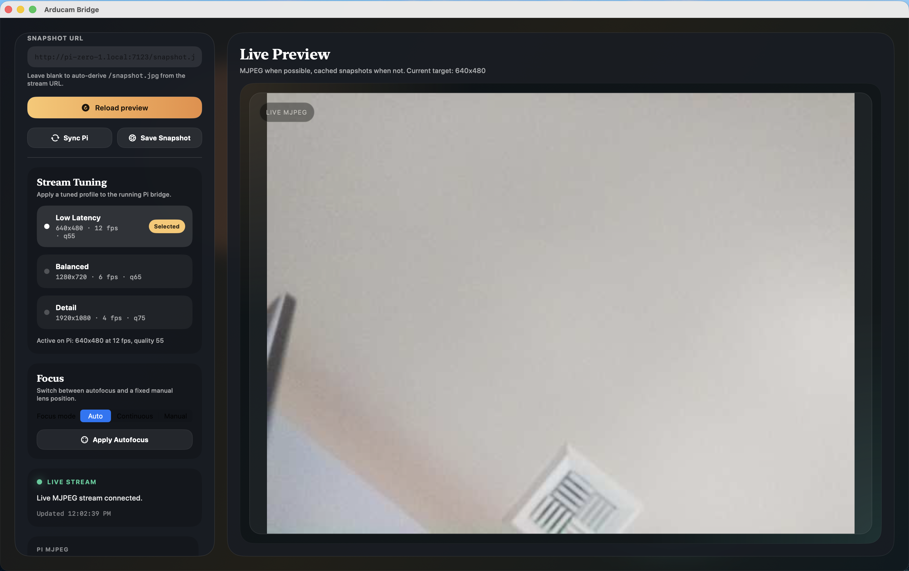

# ArducamBridge

ArducamBridge turns an Arducam 64MP OV64A40 on a Raspberry Pi into a controllable MJPEG camera service with native Apple clients and an optional Mac-side detection and training workflow.



It is designed for a simple deployment model:

- Raspberry Pi bridge service that exposes live MJPEG, snapshots, health, and runtime settings
- Native macOS viewer for desktop operation and local detector/training workflows
- Native iPhone and iPad app for pocket monitoring, controls, and snapshot capture
- Lightweight shell tooling for Pi install, Mac packaging, and TestFlight upload

## Why ArducamBridge

ArducamBridge is built for setups where you need more than a raw camera feed. It gives you a practical control plane around the stream:

- Live MJPEG streaming from `rpicam-vid`
- Snapshot fallback when live preview is temporarily unavailable
- Runtime stream profiles for latency vs detail
- Autofocus and manual lens-position control from Apple clients
- Health and settings endpoints for monitoring or integration
- Support for proxied or subpath-based stream URLs in the clients

## Working baseline

The Pi camera is working with this verified Bookworm-era configuration:

```ini
[all]
camera_auto_detect=0
dtoverlay=ov64a40,link-frequency=360000000
```

Verified on:

- Raspberry Pi Zero 2 W
- Raspberry Pi OS Lite 32-bit
- Arducam 64MP OV64A40
- macOS 14 or newer for the desktop viewer

## Quick Start

### 1. Configure the Pi camera

Add the verified overlay to `/boot/firmware/config.txt`, then reboot:

```ini
[all]
camera_auto_detect=0
dtoverlay=ov64a40,link-frequency=360000000
```

Verify the camera on the Pi:

```bash
rpicam-still --list-cameras
rpicam-still --nopreview --immediate --width 1280 --height 720 --output /tmp/test.jpg
```

### 2. Install the bridge service

From this repository:

```bash
PI_HOST=<pi-ip-or-hostname> PI_USER=<pi-user> ./scripts/install-pi-streamer.sh
```

If the Pi uses password authentication, you can also set `PI_PASS=<password>`. This requires `sshpass` on the local machine.

The installer:

- copies `bridge_streamer.py` to the Pi
- installs the `systemd` unit
- writes the default runtime profile
- enables and starts the service on port `7123`

Default bridge profile after install:

```text
1280x720 @ 6 fps, MJPEG quality 65
```

### 3. Confirm the stream

Open the Pi endpoints in a browser or use them from another client:

- Stream: `http://<pi-host>:7123/stream.mjpg`
- Snapshot: `http://<pi-host>:7123/snapshot.jpg`
- Health: `http://<pi-host>:7123/healthz`
- Settings: `http://<pi-host>:7123/settings`

### 4. Launch the macOS viewer

Run the app directly during development:

```bash
swift run ArducamBridgeViewer
```

Or build a standalone `.app` bundle:

```bash
./scripts/build-mac-app.sh
open ./dist/ArducamBridgeViewer.app
```

The macOS app includes:

- Editable MJPEG and snapshot URLs
- Connect, reload, and Pi sync controls
- Stream tuning presets: `Low Latency`, `Balanced`, `Detail`
- Autofocus or manual lens-position control
- Snapshot saving to a local `.jpg`
- `Raw Pi`, `Detection`, and `Capture` preview modes
- Local detector controls: backend, weights, confidence, classes of interest, start/stop, log tail, and health summary
- Product capture tools: freeze frame, draw boxes, save YOLO labels, and track dataset counts
- Local training controls: backend, base weights, epochs, image size, batch size, run name, log tail, and reuse-latest-model shortcut
- Live status that switches between stream and fallback mode

Default viewer targets:

```text
Stream:   http://pi-zero-1.local:7123/stream.mjpg
Snapshot: http://pi-zero-1.local:7123/snapshot.jpg
```

### 5. Launch the iPhone and iPad app

Open [ArducamBridge.xcodeproj](/Users/core/Documents/GitHub/ArducamBridge/ArducamBridge.xcodeproj) in Xcode and run the `ArducamBridge` target on a device or simulator.

The iOS app includes:

- saved bridge profiles
- live preview and snapshot fallback
- runtime stream profile controls
- focus controls
- snapshot library for saved frames

For TestFlight packaging and upload, see [docs/IOS_RELEASE.md](/Users/core/Documents/GitHub/ArducamBridge/docs/IOS_RELEASE.md) and [scripts/upload-testflight.sh](/Users/core/Documents/GitHub/ArducamBridge/scripts/upload-testflight.sh).

## In-app workflow

1. Leave the Pi URLs pointed at the raw bridge stream.
2. In `Detection`, start the local detector. The app writes `configs/vending.generated.yaml` and launches the Mac-side service.
3. Switch to `Capture`, freeze a product frame, draw one or more boxes, and save the sample.
4. The app writes images into `datasets/vending/images/{train,val}` and YOLO labels into `datasets/vending/labels/{train,val}`.
5. Start training from the `Training` card.
6. When training completes, use `Use Latest Model` and restart the detector.

## Detection and tracking

Run detection on the Mac, not on the Pi Zero 2 W. The Pi only streams frames. Inference and tracking run locally against the MJPEG feed.

Default stack in this repo:

- Detector: Ultralytics `yolo26n.pt`
- Tracker: `supervision.ByteTrack`
- Input: Pi stream at `http://pi-zero-1.local:7123/stream.mjpg`
- Output: local annotated stream at `http://127.0.0.1:9134/annotated.mjpg`

Why this is the default:

- `YOLO26` is the safer default for this repo because Ultralytics supports tracking workflows around YOLO models directly.
- `RT-DETR` can still be used by switching `model.backend` to `rtdetr` in the config, but it is not the default choice here for vending because the official Ultralytics RT-DETR docs do not position it as the primary tracking path.
- `supervision.ByteTrack` gives explicit control over stable IDs and zone-crossing events, which is more useful than raw detector output for vending logic.

Run the detector service:

```bash
./scripts/run-vending-detector.sh ./configs/vending.example.yaml
```

Or start it from the app in the `Detection` card. The app writes the generated runtime config to `configs/vending.generated.yaml` and launches the same service locally.

Useful detector endpoints:

- Annotated stream: [http://127.0.0.1:9134/annotated.mjpg](http://127.0.0.1:9134/annotated.mjpg)
- Annotated snapshot: [http://127.0.0.1:9134/snapshot.jpg](http://127.0.0.1:9134/snapshot.jpg)
- Health: [http://127.0.0.1:9134/healthz](http://127.0.0.1:9134/healthz)
- Events: [http://127.0.0.1:9134/events](http://127.0.0.1:9134/events)

Point the Mac viewer at the annotated stream if you want to watch detections instead of the raw Pi feed:

```text
http://127.0.0.1:9134/annotated.mjpg
```

Detector config lives in [configs/vending.example.yaml](configs/vending.example.yaml). The most important fields are:

- `model.weights`: replace `yolo26n.pt` with your trained vending-product checkpoint
- `model.classes_of_interest`: limit tracking to product classes you care about
- `inventory.zones`: normalized polygons that represent shelf regions

## Product capture and training

The app writes a YOLO-style dataset rooted at `datasets/vending`:

- `images/train`
- `images/val`
- `labels/train`
- `labels/val`
- `classes.json`
- `data.yaml`

Validation images are assigned automatically at roughly a `4:1` train-to-val split as you save samples.

You can also validate or launch training outside the app:

```bash
./scripts/train-vending-model.sh ./datasets/vending yolo yolo26n.pt 40 960 8 vending-products ./runs/vending-training auto
```

Use `1` as the last argument to run dataset validation only:

```bash
./scripts/train-vending-model.sh ./datasets/vending yolo yolo26n.pt 40 960 8 vending-products ./runs/vending-training auto 1
```

Current event semantics:

- `removed_candidate`: a tracked object was stable inside a shelf zone, then stably moved outside it
- `returned_candidate`: a tracked object was stable outside a shelf zone, then stably moved back inside it

This is a prototype for vending telemetry, not a billing-grade decision engine. Do not auto-charge customers from the generic `yolo26n.pt` model or from zone transitions alone. For production you need:

- A custom-trained SKU model for every vendable product
- Shelf-specific zones per row or per slot
- Session logic that ties removals to a customer interaction window
- Reconciliation rules for occlusion, returns, and multi-item grabs
- A commercial-license review for any third-party model stack you deploy in a product

## HTTP API

### `GET /healthz`

Returns:

- bridge liveness
- `camera_running` state
- frame counters and frame age
- the active bridge settings
- the latest runtime error, if present
- request-host-relative `stream_url`, `snapshot_url`, and `settings_url`

### `GET /settings`

Returns the current bridge settings as JSON.

### `POST /settings`

Updates bridge settings at runtime. Supported fields include:

- `width`
- `height`
- `framerate`
- `quality`
- `rotation`
- `camera`
- `autofocus_mode`
- `autofocus_range`
- `autofocus_speed`
- `lens_position`

### `GET /snapshot.jpg`

Returns the latest available JPEG frame.

### `GET /stream.mjpg`

Returns the live multipart MJPEG stream.

## Reverse Proxy and Subpath Support

The Apple clients derive control endpoints as siblings of the entered stream URL. That means a stream such as:

```text
http://<host>/camera/stream.mjpg
```

maps automatically to:

- `http://<host>/camera/healthz`
- `http://<host>/camera/settings`
- `http://<host>/camera/snapshot.jpg`

This makes the clients usable behind reverse proxies and path-based routing.

## Repository Layout

- `pi/bridge_streamer.py`: Pi bridge server and MJPEG pump
- `pi/arducam-bridge.service`: `systemd` unit for the Pi service
- `scripts/install-pi-streamer.sh`: installer that deploys the bridge to a Pi over SSH
- `scripts/build-mac-app.sh`: bundle builder for `ArducamBridgeViewer.app`
- `scripts/run-vending-detector.sh`: Mac-side detector service launcher
- `scripts/train-vending-model.sh`: Mac-side training launcher for labeled product datasets
- `scripts/generate_ios_app_icons.swift`: icon generator for the iOS app asset catalog
- `scripts/upload-testflight.sh`: archive, export, and TestFlight upload script for the iOS app
- `vision/train_vending_model.py`: Ultralytics training entrypoint used by the app and shell script
- `vision/vending_tracker_service.py`: object detection, tracking, zone transitions, and annotated stream service
- `configs/vending.example.yaml`: detector and shelf-zone configuration template
- `configs/vending.generated.yaml`: runtime detector config written by the app
- `datasets/vending`: YOLO-style dataset root used by capture and training flows
- `Package.swift`: Swift package definition for the macOS app
- `Sources/ArducamBridgeViewer/`: SwiftUI macOS viewer source
- `App/ArducamBridge/`: SwiftUI iPhone and iPad app source
- `ArducamBridge.xcodeproj`: Xcode project for device builds and TestFlight uploads
- `docs/IOS_RELEASE.md`: release notes for the TestFlight flow

## License

[MIT](LICENSE)
